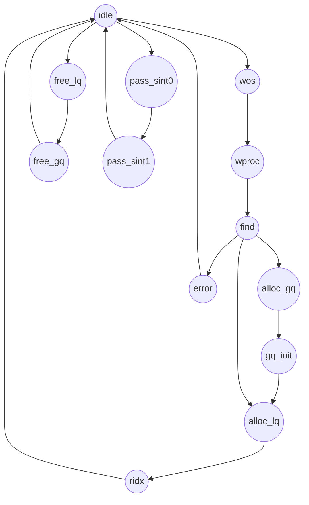

# Controller

## 控制器状态机

控制器用于资源分配、回收，以及软件中断的转发；

### 资源分配

分配流程：

1. 向控制器的 `alloc` 接口写 os 标识
2. 向控制器的 `alloc` 接口写 process 标识（process 为 0 表示这个一个内核）
   1. 控制器查找是否已经给 os_process 分配了全局队列，若没有，则分配一个全局队列；若已经分配，则转到 2.3；若控制器已经没有资源，则进入 error 状态，但不会停留在这个状态；
   2. 分配全局队列后，初始化这个全局队列（写 os、process 标识）
   3. 分配局部队列
3. 从控制器的 `alloc` 接口读出分配给对应的 os_process 的索引（对应的资源的访问接口的索引，`全局队列下标` + `局部队列下标`，软件在访问这个接口时，需要根据控制器的基址以及这个索引来计算出对应的局部队列能够访问的 MMIO 地址，控制器基址 + 0x1000 + (全局队列下标 * 局部队列数量 + 局部队列下标) * 0x1000）

释放流程：

1. 向控制器的 `free` 接口写分配给 os_process 对应的索引
   1. 控制器根据 os_process 索引确定全局队列下标和局部队列下标
   2. 回收局部队列
   3. 若局部队列的数量为 0，则回收全局队列

### 软件中断转发

1. 当某个 os_process 对应的全局队列的中断信号拉起后，控制器进入 pass_sint0 状态，检查是否存在对应的接收方
   1. 目前的处理是接收方不在线或者不存在时，直接丢弃掉这个中断信号
2. 当接收方存在时（控制器能够找到接收方 os_process 对应的全局队列），将中断信号转发给接收方对应的全局队列