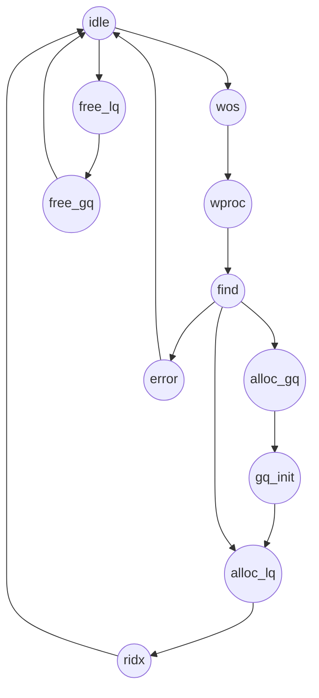

# hd_alloc_free_queue

控制器分配任务队列的状态机

```mermaid
graph TB
0((idle))
1((wos))
2((wproc))
3((find))
4((alloc_gq))
5((gq_init))
6((alloc_lq))
7((ridx))
8((free_lq))
9((free_gq))
10((error))

0 --> 1
1 --> 2
2 --> 3
3 --> 4
4 --> 5
5 --> 6
6 --> 7
3 --> 6
3 --> 10
10 --> 0
0 --> 8
8 --> 9
9 --> 0
7 --> 0
```
