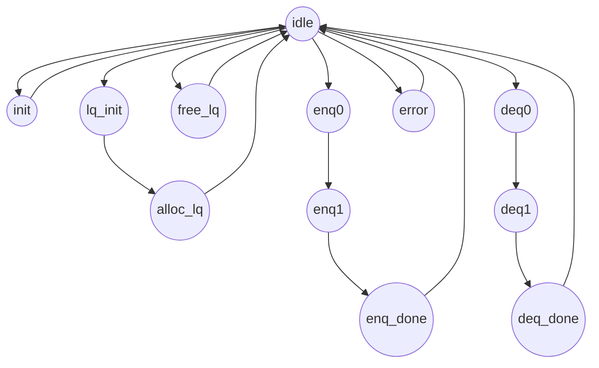

# hd_global_queue

全局队列的状态机

```mermaid
graph TB
0((idle))
1((init))
2((lq_init))
3((alloc_lq))
4((free_lq))
5((enq0))
6((enq1))
7((enq_done))
8((deq0))
9((deq1))
10((deq_done))
11((error))

0 --> 1
1 --> 0
0 --> 2 --> 3 --> 0
0 --> 4 --> 0
0 --> 5 --> 6 --> 7 --> 0
0 --> 8 --> 9 --> 10 --> 0
0 --> 11 --> 0

```
