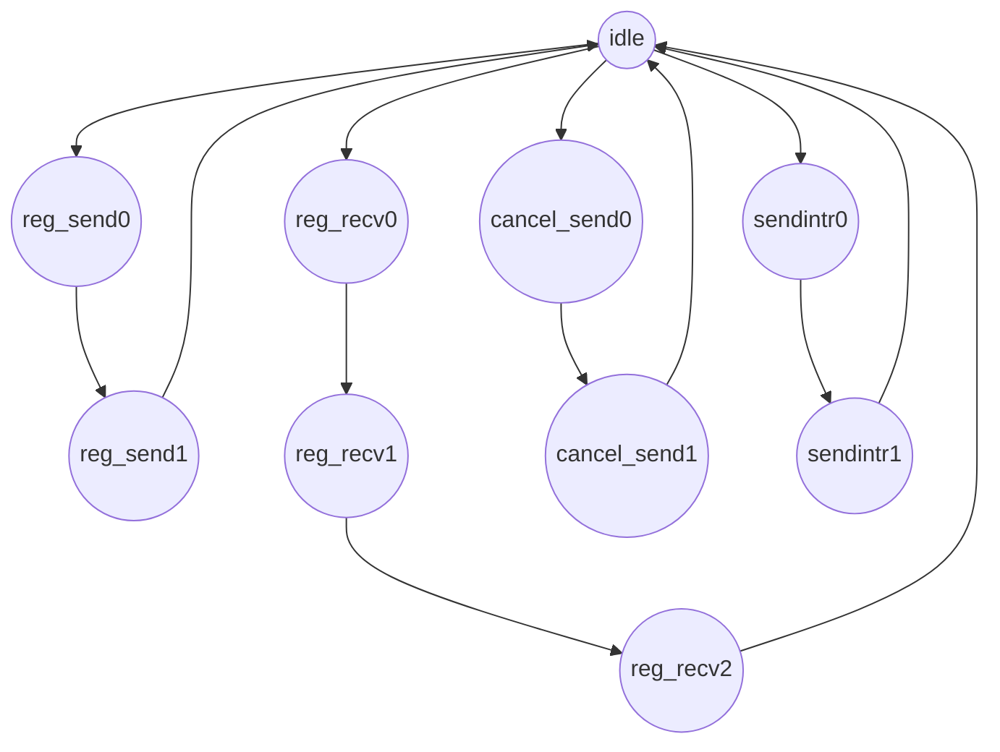
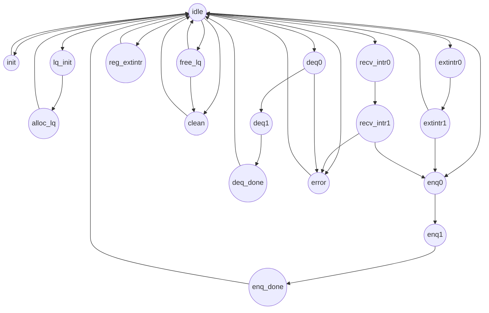

# hd_global_queue

## 与软件中断相关的状态机

包括注册、取消发送方接收方、发送中断等



这里将与软件中断相关的部分状态机与全局队列的状态机进行分离，因为注册、取消、发送只会影响到全局队列对应的软件中断的表项，不会影响到全局队列中的任务的出队入队操作，只有在接收软件中断进行处理时，才会影响到全局队列。

### 注册、取消

#### 注册发送方流程

1. 向局部队列的 `register_sender` 端口写 receiver_os 标识
2. 向局部队列的 `register_sender` 端口写 receiver_process 标识
   1. 全局队列会自动分配一个空闲槽给这个 SendCap

#### 取消发送方流程

同注册发送方流程相同，向局部队列的 `cancel_sender` 端口依次写入 receiver_os、receiver_process 标识

#### 注册接收方流程

1. 向局部队列的 `register_receiver` 端口写入 sender_os 标识
2. 向局部队列的 `register_receiver` 端口写入 sender_process 标识
3. 向局部队列的 `register_receiver` 端口写入对应的处理任务 handler 标识
   1. 全局队列自动分配一个空闲槽给 RecvCap

> 注意：每个局部队列都会存在注册、取消、发送的端口，但全局队列中只有一个数据结构来记录这些发送和接收的能力（SendCap、RecvCap），全局队列中通过一个仲裁器来保证在同一时刻只会有一个能力被注册成功。这些发送、接收中断的能力只会被赋给 OS 或者 process，所以，局部队列中的端口（除了出队、入队端口）是等价的，只会对全局队列中唯一的数据结构产生影响，这样是为了保证提供给软件的端口是一致的。

## 全局队列的状态机

因为每次对局部队列的操作会影响到全局队列，因此需要在同一个状态机中。



### 就绪队列

任务的就绪队列以 `全局队列` + `局部队列` 的形式组成，整个任务队列共用同一块存储区域（DataArray），每个局部队列的元信息由头指针和任务数量组成。如下所示：

```sh
global_queue
+-------+-------+---------+-------+
| lq0   | lq1   |  ...... | lqn   |
+-------+-------+---------+-------+
```

**出/入队**：当某个局部队列入队/出队，其任务数量 +/- 1，后续的局部队列的头指针右移/左移。当整个全局队列容量满时，无法入队，将在 error 寄存器中记录队列已满的信息；当全局队列没有任务时，此时继续从队列中取出任务将会返回 0，表示没有任务。
 1. 入队：
    1. 软件写 MMIO 端口且全局队列处于 idle 状态，此时全局队列进入到 enq0 状态。
    2. 全局队列找到对应的局部队列，获取对应的尾指针，并将后面的局部队列的头指针后移，并进入 enq1 状态。
    3. 全局队列根据 enq0 状态获取到的尾指针，向 DataArray 中指定的位置插入元素，后续的元素后移。
 2. 出队：同上，但增加了负载均衡的功能
    1. 软件读 MMIO 端口且全局队列处于 idle 状态，此时全局队列进入到 deq0 状态。
    2. 全局队列找到对应的局部队列，获取对应的头指针，并将后面的局部队列的头指针前移，并进入 deq1 状态；若该局部队列中没有元素，则会获取到找到其他具有任务的局部队列的头指针，同理将后面的局部队列头指针前移，进入 deq1 状态；若该局部队列已经被回收，此时会进入到 error 状态，记录错误信息，进而回到 idle 状态。
    3. 全局队列根据 deq0 状态获取的头指针，从 DataArray 中取出元素，后续的元素前移。

**负载均衡**：当某个局部队列中没有元素时，继续从这个局部队列中取出任务会从其他的有任务的队列中窃取出任务，窃取的优先级从左往右依次降低。

**优先级队列**：局部队列本身没有实现优先级排序，采用了 FIFO 的方式，但整个就绪队列可以作为优先级队列来使用，每一个局部队列对应了不同的优先级。


### 分配和回收局部队列

分配和回收的流程由控制器来驱动，软件只能通过控制器来操作，不能直接访问这些端口。

分配流程：控制器第一次分配一个局部队列给 os_process 时，会先初始化全局队列（设置 os_process），再分配第一个局部队列；后续继续分配局部队列给这个 os_process 时，局部队列的头指针将指向前一个局部队列的尾部，但其中的任务数量取决于原本这个队列中的状态。在回收流程中进行了详细描述。

回收流程：控制器释放某个局部队列，若这个全局队列中没有局部队列存在时，整个全局队列将被清空，并被控制器回收。这里需要注意，被回收时：

1. 若局部队列中没有任务，则不会产生任何影响。
2. 若局部队列中仍然存在任务，这个队列元信息中记录任务数量的 count 不会清零，DataArray 中仍然保留了原来的任务，当其他的局部队列中没有任务时，可以从这个局部队列中窃取出任务，相当于在回收时将这些剩余的任务进行了转移。但软件是无法继续从这个已经被回收的队列对应的端口取出任务的。
3. 当局部队列中仍然存在任务，但这个局部队列被回收之后，又再次被申请使用，则原有的任务会在这个局部队列的前面，后续入队的任务将在这些任务之后。这些原有的任务被当作遗产继承给了后续的使用者。

若要避免这些情况，那么软件在通过控制器回收这个局部队列时，应该确保局部队列中没有任务。

### 外部中断

每个局部队列直接给软件暴露了相应的端口来注册外部中断的处理任务，外部中断的处理任务与外部中断的编号来对应，全局队列中只有一个数据结构 ExtIntrSlots 记录外部中断处理能力。

处理流程：

1. 当中断信号的 pending 寄存器拉高且控制器处于 idle 状态时，全局队列将进入到 extintr0 状态。
2. 全局队列尝试从自己的 ExtintrSlots 中取出对应的处理任务 handler，清空中断信号对应的标记位（表示已经完成了中断处理的前半段），并进入到 extintr1 状态。
3. 若存在对应的 handler，则会进入到 enq0 阶段；否则，回到 idle 状态。

> 关于多个中断处理的实现细节描述:
> 针对每个中断信号，维护了 pending 寄存器；在中断信号的上升沿时，pending 寄存器将会拉高，后续中断信号持续高电平不会产生影响；全局队列进入到 extintr0 状态时，会将 pending 寄存器拉低；后续即使中断信号还没有变成低电平或者处于下降沿不会产生影响；
> 若同时存在多个中断信号，对应的 pending 寄存器拉高时，会按照中断信号对应的编号顺序进行处理（目前是优先处理 0 号外部中断）

外部中断的处理可以无视特权级，让用户态运行的程序可以使用，但这里需要注意：

> 需要由软件来保证对于某个外设的中断信号在任意时刻只会有一方在使用，如果两个 os_process 同时都注册了同一个外设中断的处理任务，则会同时唤醒这两个任务。

### 软件中断

每个局部队列直接给软件暴露了相应的端口来注册/取消软件中断处理任务、发送软件中断，软件中断的处理任务由对应的 os_process 标识进行区分。全局队列中只有一个数据结构 SoftIntrSlots 记录软件中断处理能力（SendCap、RecvCap）。

在注册完接收方和发送方后，发送方通过向 MMIO 端口中写 receiver_os 标识和 receiver_process 标识来发起中断，其流程如下：

1. 发送方流程
   1. 发送方向 `send_intr` 端口写 receiver_os 标识，软件中断处理模块（softintr）记录 receiver_os 标识，进入到 sendintr0 状态。
   2. 发送方向 `send_intr` 端口写 receiver_process 标识，softintr 记录 receiver_process 标识，进入到 sendintr1 状态.
   3. softintr 检查 SoftIntrSlots 中是否存在 receiver_os 和 receiver_process 标识对应的发送能力，如果存在这个能力，则会将软件中断对应的信号拉高。
   4. 当控制器接收到中断信号后（控制器进入 pass_sint0 状态），发送方将中断信号拉低。
2. 控制器流程
   1. 当控制器处于 idle 状态，且存在某个全局队列的软件中断信号拉高后，进入 pass_sint0 状态。
   2. 控制器记录这次中断对应的发送方 os_process 标识和接收方对应的 os_process 标识，并进入 pass_sint1 状态。
   3. 若控制器发现存在接收方对应的 os_process 的全局队列，则将发送方的 sender_os 和 sender_process 标识发送给接收方，并回到 idle 状态；若控制器没有发现接收方，目前直接丢弃了这个中断，后续还可增加额外的处理。
3. 接收方流程
   1. 接收方全局队列收到控制器转发的软件中断信号且为 idle 状态时，记录发送方的 sender_os 和 sender_process 标识，进入到 recv_intr0 状态。
   2. 接收方 softintr 检查 SoftIntrSlots 中是否存在 sender_os 和 sender_process 标识对应的接收能力，进入 recv_intr1 状态。
   3. 如果存在这个能力，则获取到这个能力对应的处理任务 handler，并进入到 enq0 状态，如果没有这个能力，则回到 idle 状态。

> 若同时存在多个发送方发起软件中断，则按照全局队列的编号顺序进行处理，目前是优先处理 0 号发送方的软件中断。

**注意：目前关于外部中断和软件中断任务的唤醒，都是将其放在第一个局部队列的尾部，后续可以增加额外的逻辑来实现抢占，将其置于头部，并保证下一次任务必定取到被唤醒的任务。由于纯硬件维护任务状态会导致逻辑复杂，当中断处理任务被唤醒后，如果仍然保留在 Slots 中，则无法获取其状态（是否处于就绪还是正在运行，尽管可以针对每个局部队列维护 current 记录当前正在运行的任务，但是会导致缺少对应的与中断相关的信息，例如对应的外部中断的编号，对应的发送方的 os_process 标识，后续维护任务状态会带来麻烦），会导致多次唤醒，因此，目前的实现是唤醒一次之后，对应的 Slots 将会被清空，需要由软件重新注册。**